# Intelligent Bin Picking in Simulink using Gemini Robotics ER

[](#)
[](#)

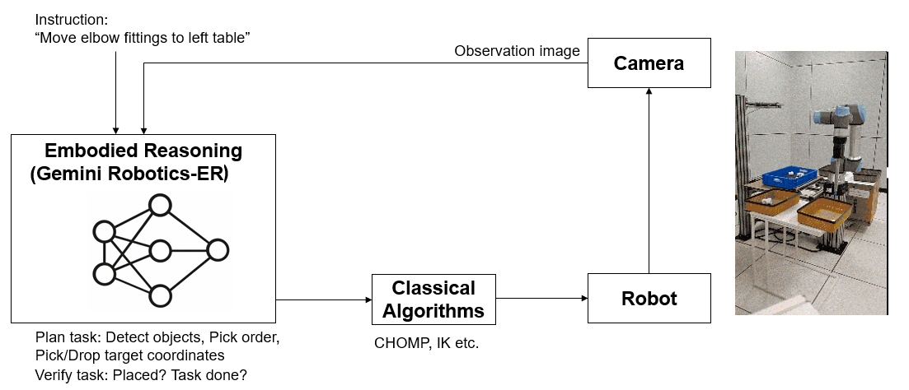

- [Overview](#overview)
- [Setup](#setup)
- [Getting Started](#getting-started)
- [Model Details](#model-details)
- [Limitations](#limitations)
- [References](#references)
- [License](#license)
- [Feedback](#feedback)
- [Community Support](#community-support)

## Overview

[Gemini Robotics ER](https://ai.google.dev/gemini-api/docs/robotics-overview) is a vision-language model with embodied reasoning (ER) capabilities: spatial understanding, object recognition, and scene interpretation grounded in physical context. Unlike general-purpose vision models, Gemini Robotics ER can interpret a camera image in terms of robot-actionable outputs: object locations, pick sequences, and placement targets derived from a natural-language instruction. This eliminates the need for custom-trained object detectors or hand-crafted pick rules (traditionally weeks of data collection and model training) and lets you set up new task plans in minutes by writing a natural-language prompt instead of programming scheduler logic.

This example uses Gemini Robotics ER for two stages of a pick-and-place loop:

- **Task planning**: The overhead camera image and a natural-language instruction (e.g. *"Place all elbow fittings on the right table"*) are sent to Gemini. Embodied reasoning grounds the instruction spatially: Gemini identifies each relevant object by type, colour, and shape; localises it with a pixel bounding box; infers the intended destination from the workspace context (bin, left table, right table); and returns a pick priority order. The result is a structured JSON plan (pick boxes, drop boxes, pick order) produced without any pre-trained object detector or object template.
- **Task verification**: After the robot completes its actions, two images are sent to Gemini: the scene before the task started and the current scene. Embodied reasoning is used to compare object positions across both images and determine whether every object specified in the instruction has moved to its correct destination. Gemini returns a pass/fail judgement with a natural-language explanation (e.g. *"Task unsuccessful. The blue tee fitting was not placed."*).

The simulation environment is adapted from the [Intelligent Bin Picking System in Simulink&reg;](https://www.mathworks.com/help/robotics/ug/intelligent-bin-picking-system-in-simulink.html) example (Robotics System Toolbox&trade;). The original example uses a Mask R-CNN object detector and a rule-based task scheduler; this project replaces the detector with Gemini Robotics ER and extends the scheduler to accept natural-language task instructions with flexible pick ordering and cross-bin placement.

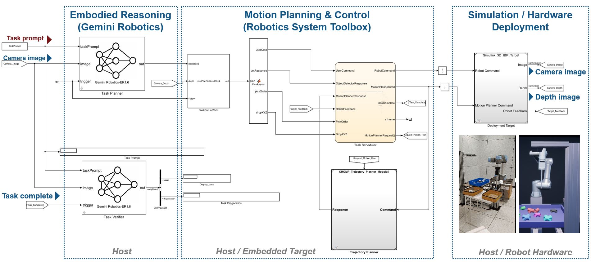

## Setup

### MathWorks Products

Requires MATLAB&reg; R2026a or newer.
- [Robotics System Toolbox&trade;](https://www.mathworks.com/products/robotics.html)
- [Simulink&reg;](https://www.mathworks.com/products/simulink.html)
- [Stateflow&reg;](https://www.mathworks.com/products/stateflow.html)
- [Simulink&reg; 3D Animation&trade;](https://www.mathworks.com/products/3d-animation.html)

Requires a host platform C compiler; see [Supported Compilers](https://www.mathworks.com/support/requirements/supported-compilers.html).

### 3rd Party Products

- [Python](https://www.python.org/) 3.13: MATLAB&reg;-Python cosimulation for Gemini API calls
- [google-genai](https://pypi.org/project/google-genai/): Gemini API client
- [Pillow](https://pypi.org/project/Pillow/): image encoding
- [numpy](https://numpy.org/): array interchange between MATLAB and Python

All packages are installed automatically via `installPythonEnv`.

**1. Install dependencies (run once after cloning)**

In MATLAB&reg;, from the repo root:
```matlab
installPythonEnv                  % downloads Python 3.13 + packages
installIntelligentBinPicking      % fetches "Intelligent Bin Picking in Simulink" example
```

**2. Start each MATLAB session**

```matlab
projectstartup                    % adds paths, configures Python environment
setenv('GEMINI_API_KEY', 'your-key-here')
```

Get a free API key from [Google AI Studio](https://aistudio.google.com/apikey).

### Verify Setup

Verify the Python environment and Gemini API are reachable:

```matlab
runtests("test/testPythonEnv.m")   % no API key required
runtests("test/testGeminiAPI.m")   % requires GEMINI_API_KEY; auto-skips if unset
```

## Getting Started

Run `projectstartup` at the beginning of each MATLAB&reg; session to configure paths and the Python environment:

```matlab
projectstartup
```

### Scene Reference

The overhead camera sees the bin with colored pipe fittings (elbows, crosses, tees, straights). Use this view as a reference when writing task prompts:

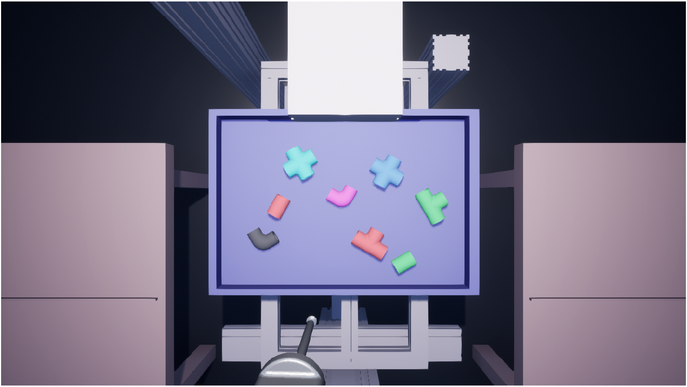

Objects are distinguishable by **color** (red, green, blue, cyan, magenta, black) and **shape** (elbow, cross, tee, straight). Prompts can reference either attribute, spatial position (leftmost, rightmost), or combinations.

### Running a Scenario

Open the model, set a natural-language task prompt, and simulate:

```matlab
modelName = "IntelligentBinPickingGemini";
open_system(modelName)

taskPrompt = "Place all elbow fittings on the right table. " + ...
             "Place all cross fittings on the left table.";
sim(modelName);
```
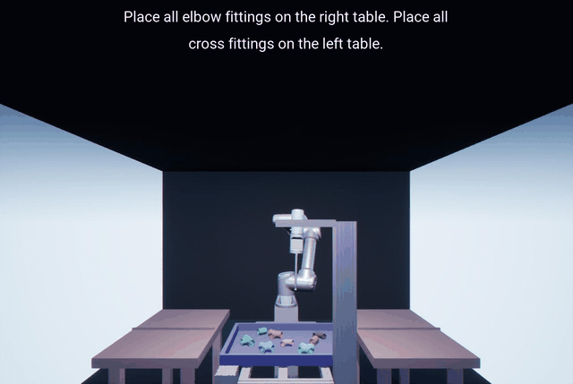

`taskPrompt` must be set in the MATLAB&reg; base workspace before `sim()`. The `UserPrompt` StringConstant block reads this variable. Alternatively, double-click the block and edit the **String** parameter directly.

#### More scenarios

- Sort by position: leftmost → left table, rightmost → right table
```matlab
taskPrompt = "Pick the leftmost fitting and place it on the left table. " + ...
             "Pick the rightmost fitting and place it on the right table.";
sim(modelName);
```
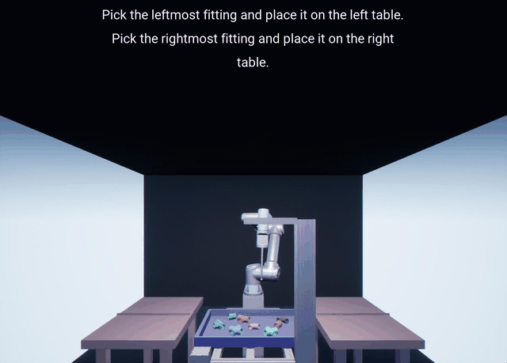

- Priority + exclusion: cyan crosses first → left table, then green tee and red tee → right table, black and pink fittings stay in bin
```matlab
taskPrompt = "Pick the cyan cross fitting and place them on the left table. " + ...
             "Then pick the green tee fitting and place it on the right table. " + ...
             "Then pick the red tee fitting and place it on the right table. " + ...
             "Leave the black and pink fittings in the bin.";
sim(modelName);
```
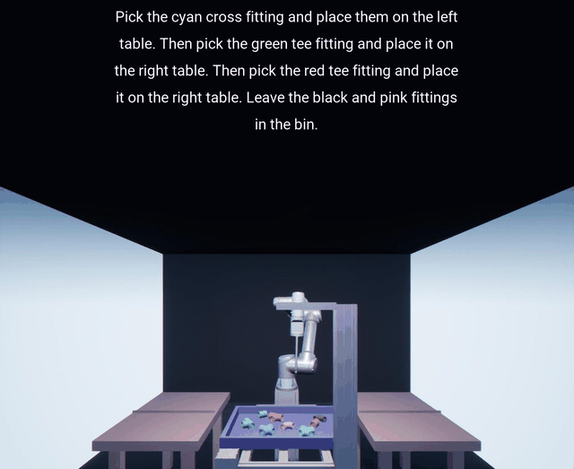

- Sort by color temperature: warm (red, magenta) → right table, cool (blue, cyan, green) → left table, black stays in bin
```matlab
taskPrompt = "Place all warm-colored fittings (red, magenta) on the right table. " + ...
             "Place all cool-colored fittings (blue, cyan, green) on the left table. " + ...
             "Leave any black fittings in the bin.";
sim(modelName);
```
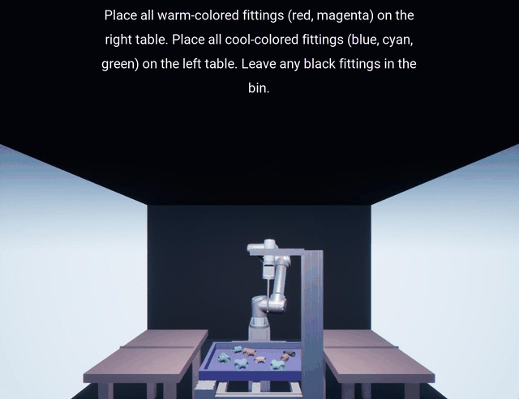

### Randomizing Object Positions

Each simulation starts with a fixed object layout by default. To test robustness across different arrangements, randomize positions before running:

```matlab
rng(42);           % any seed you like
robotSimParams;    % regenerates spawn positions with the new seed
sim(modelName);
```

The randomization shuffles the assignment of objects to the 8 predefined spawn locations in the bin and varies their orientations, producing a unique scene each time.

### Using the Demo App

To run scenarios interactively, launch the demo app:

```matlab
geminiDemoApp
```

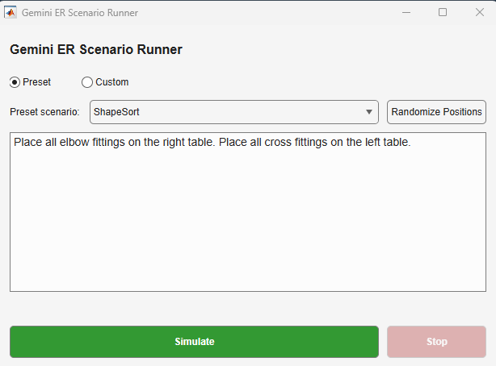

The app lets you:
- Select a **preset scenario** from the dropdown or switch to **Custom** mode and type any natural-language task prompt
- **Randomize Positions** — shuffles object locations in the bin before each run, so you can test the same prompt against different arrangements
- **Simulate** / **Stop** — starts or halts the Simulink&reg; simulation

### Recording Video

To save a video of the simulation, uncomment the **Simulation 3D Video Writer** block in `Simulink_3D_IBP_Target` and set its **Filename** parameter to the desired output path (e.g. `results/my_run.avi`). Create the output directory first if needed: `mkdir results`.

### Cleanup

When done, run `projectshutdown` to remove paths:

```matlab
projectshutdown
```

## Model Details

### Gemini Robotics ER Block

The core building block is `geminiERBlock` (`GeminiRobotics.slx`), a MATLAB&reg; System block that handles the Gemini API call, trigger logic, and result caching. Its behaviour is controlled by a `Mode` parameter, which is a `GeminiERBase` subclass instance. Two modes are provided:

- **`GeminiERPlan`**: task planning mode. Takes a camera image and a natural-language task prompt; returns a `geminiPixelDetectionsBus` containing pick bounding boxes, drop bounding boxes, and pick order in pixel coordinates.
- **`GeminiERVerify`**: verification mode. Holds a before-image (anchored at simulation start) and compares it with the current camera image when triggered; returns a `geminiVerifyResultBus` with a pass/fail flag and a diagnostic string.

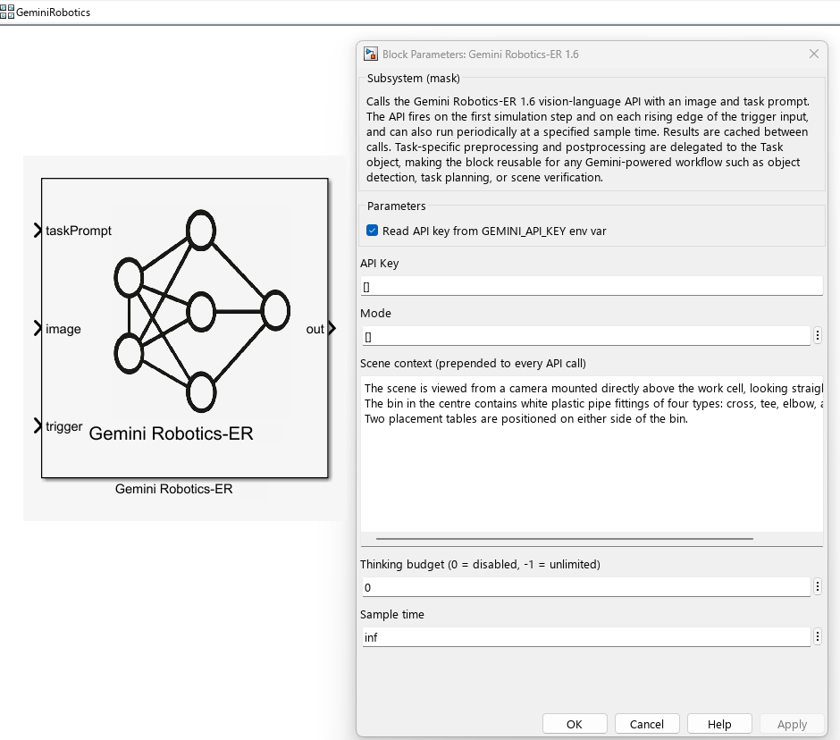

The block and its parameters as configured in `IntelligentBinPickingGemini.slx`:

**Task Planner** (`Mode = GeminiERPlan`)

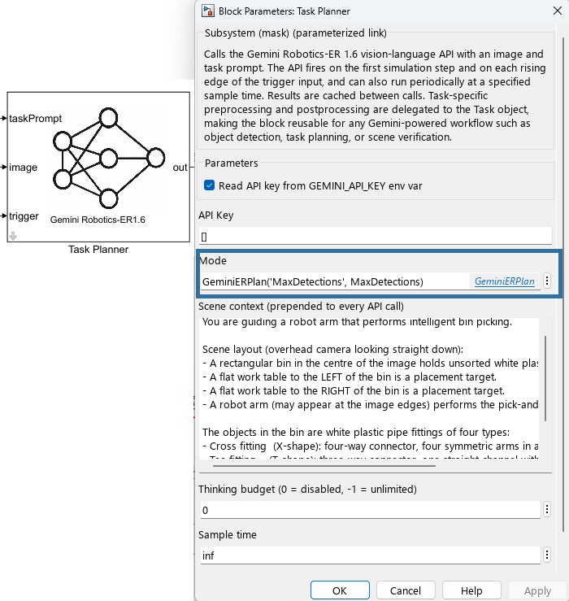

**Task Verifier** (`Mode = GeminiERVerify`)

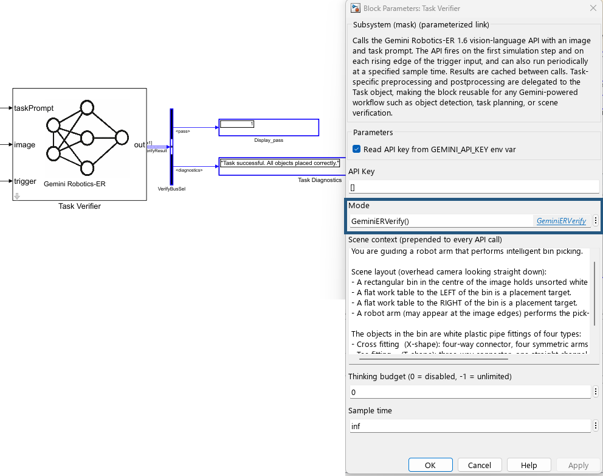

**`system_instruction`** — assembled once per task

| Layer | Plan | Verify | Source |
|---|---|---|---|
| **Common rule** | "Reply ONLY with valid JSON. No markdown fences." | same | Hardcoded, shared — `GeminiERBase.SystemPrompt` |
| **Role** | "You are guiding a robot arm..." | "You are verifying a robot arm..." | Hardcoded, per mode — `getRole()` in each subclass |
| **Format schema** | JSON array: `label`, `box_2d`, `drop_box_2d`, `pick_priority` | `{"pass": true/false, "diagnostics": "..."}` | Hardcoded, per mode — `getFormatSchema()` in each subclass |

**`contents`** — changes on every call

| Layer | Content | Source |
|---|---|---|
| **Scenario** | "The scene is viewed from a camera above the bin. White plastic pipe fittings of four types..." | Configured per deployment — **Scene context** block parameter |
| **User task** | "Pick the leftmost fitting..." + camera image | Changes per call — `taskPrompt` workspace variable + image input port |

A new API call fires on the first simulation step (planner only) and on any change of the `trigger` input. Results are cached between calls.

To adapt the block for a different robot or scene, subclass `GeminiERBase` and override `getRole()`, `getFormatSchema()`, and `postprocess()`.

### Other Blocks

The Pixel Plan to World block (`pixelPlanToWorldBlock`) back-projects the pixel-space pick and drop boxes from `geminiPixelDetectionsBus` to robot-base-frame XYZ coordinates using the camera intrinsics and a depth map, producing `geminiTaskPlannerBus`.

The Task Scheduler and CHOMP Trajectory Planner are carried over from the original IBP example with minimal changes: the Task Scheduler accepts a pick priority order and per-object drop positions from the Gemini planner, replacing the fixed rule-based logic. Refer to the [Intelligent Bin Picking System in Simulink](https://www.mathworks.com/help/robotics/ug/intelligent-bin-picking-system-in-simulink.html) example for a full description of the scheduler state machine, trajectory planner, and Sim3D scene.

## Limitations
- Gemini Robotics ER is currently in preview; APIs and capabilities are subject to change.
- Like other large language models, Gemini Robotics ER can hallucinate, producing incorrect detections or placement plans, especially for ambiguous prompts or unfamiliar object types.
- Vague or underspecified task instructions may produce inconsistent detections or incorrect placement assignments. Clear, specific prompts yield the most reliable results.
- Pixel-level bounding box errors become positional errors in world coordinates, which may cause missed grasps in tightly packed bins.
- API latency is typically 2-5 s per call (the first call in a session may take longer due to Python process warm-up). The planner fires once per task, not at each simulation step. Mid-task replanning on failure is not yet implemented.
- This example runs in a simulated environment with a virtual camera. Deploying on a real robot requires updating the camera intrinsics and pose parameters in `pixelPlanToWorldBlock` to match the physical camera setup.

## References

- Gemini API: [Gemini Robotics ER](https://ai.google.dev/gemini-api/docs/robotics-overview)
- MathWorks: [Intelligent Bin Picking System in Simulink](https://www.mathworks.com/help/robotics/ug/intelligent-bin-picking-system-in-simulink.html)

## License

The license is available in the [license.txt](license.txt) file in this GitHub repository.

## Security

To report a security vulnerability, see [SECURITY.md](SECURITY.md).

## Feedback

Tried this example? We'd love your feedback!

Share your experience to help us prioritize what to improve next - takes less than 5 minutes.

Give feedback ➜ [Feedback on Intelligent Bin Picking in Simulink using Gemini Robotics ER](https://www.surveymonkey.com/r/QGZ2NWN)

## Community Support

[MATLAB Central](https://www.mathworks.com/matlabcentral)

Copyright 2026 The MathWorks, Inc.
